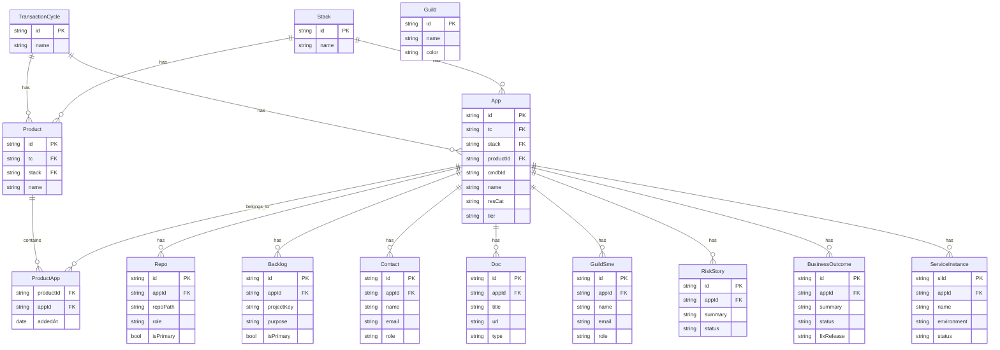

# Data Model

Schema reference.

## ERD

## Entities

| Entity | Description | Key Fields |
|--------|-------------|------------|
| `TransactionCycle` | Business domain grouping | `id`, `name` |
| `Stack` | Technology capability grouping | `id`, `name` |
| `Guild` | Governance domain (reference) | `id`, `name`, `color` |
| `Product` | Logical grouping of apps | `id`, `name`, `tc`, `stack` |
| `App` | Application in CMDB | `id`, `cmdbId`, `name`, `resCat`, `tier`, `tc`, `stack` |
| `ProductApp` | Product-App join table | `productId`, `appId`, `addedAt` |
| `Repo` | Git repository | `id`, `appId`, `repoPath`, `role`, `isPrimary` |
| `Backlog` | Jira project | `id`, `appId`, `projectKey`, `purpose`, `isPrimary` |
| `Contact` | App stakeholder | `id`, `appId`, `name`, `email`, `role` |
| `Doc` | Documentation link | `id`, `appId`, `title`, `url`, `type` |
| `GuildSme` | Guild subject matter expert | `id`, `appId`, `name`, `email`, `role` |
| `RiskStory` | Risk/security item | `id`, `appId`, `summary`, `status` |
| `BusinessOutcome` | Business objective | `id`, `appId`, `summary`, `status`, `fixRelease` |
| `ServiceInstance` | Deployment instance | `siId`, `appId`, `name`, `environment`, `status` |

## Enums

| Field | Values |
|-------|--------|
| `resCat` | `Critical` \| `High` \| `Medium` \| `Low` \| `Not_Significant` |
| `tier` | `Business Application` \| `Application Component` |
| `operationalStatus` | `Ceased` \| `Used in Production` |
| `Backlog.purpose` | `product` \| `ops` \| `security` |
| `Contact.role` | `product_owner` \| `tech_lead` \| `scrum_master` \| `support_lead` |
| `GuildSme.role` | `security` \| `data` \| `operations` \| `enterprise_architecture` |
| `Doc.type` | `Product Roadmap` \| `Architecture Vision` \| `runbook` \| `Service Vision` \| `Security Vision` \| `Test Strategy` |
| `RiskStory.status` | `Open` \| `In Progress` \| `Resolved` \| `Waived` |
| `BusinessOutcome.status` | `On Track` \| `At Risk` \| `Completed` \| `In Progress` \| `Engaged` |
| `ServiceInstance.environment` | `Prod` \| `DR` |
| `ServiceInstance.status` | `Operational` \| `Standby` \| `Maintenance` |

## Notes

> **Important:** Apps in a Product must be from the same SNOW family hierarchy (parent-child or siblings only).

- `ProductApp` is a many-to-many join: an App can belong to multiple Products
- `App.cmdbId` is the external CMDB identifier (e.g., `APP-1234`)
- `App.parent` references another App's cmdbId for hierarchy
- `Contact` and `GuildSme` share the same backend table (`stakeholders`) differentiated by `stakeholder_type`
- `Backlog.projectKey` maps to Jira project key
- `BusinessOutcome.portfolioEpv` and `navigatorId` are external system references
